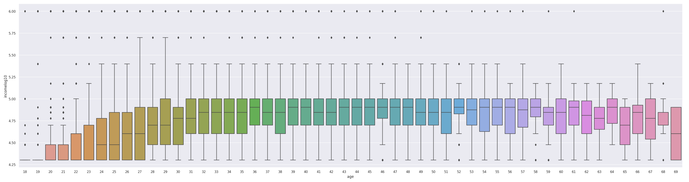
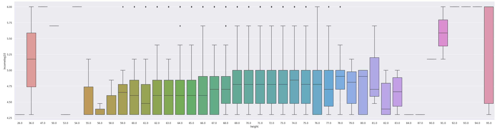
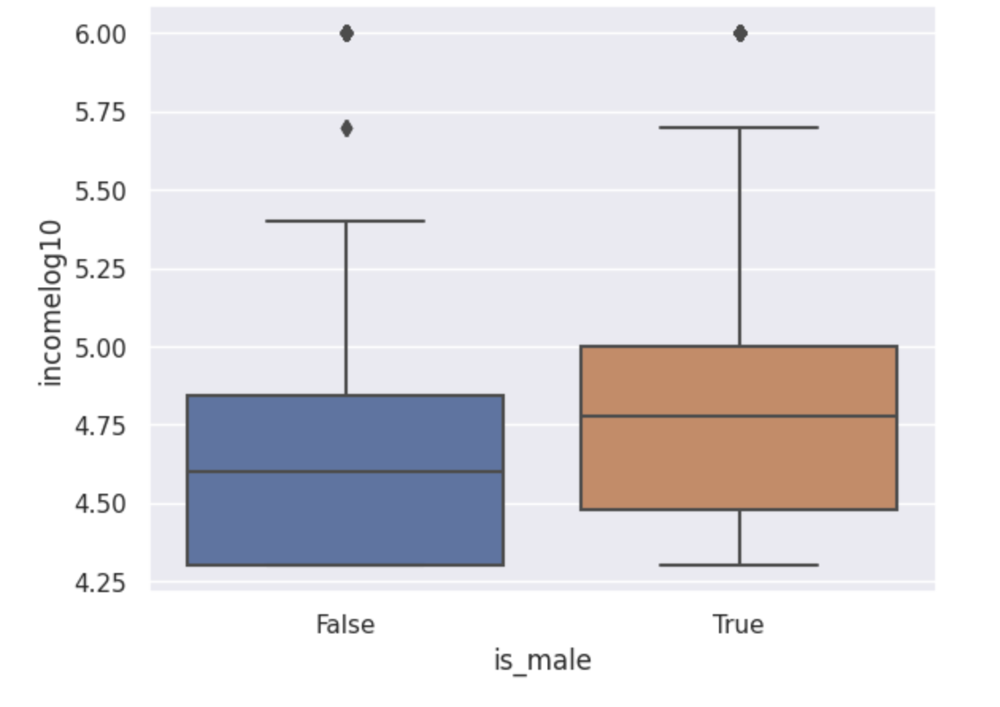
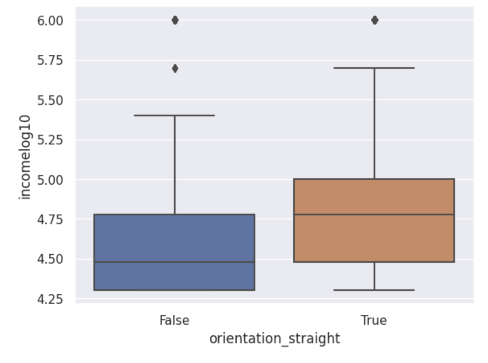
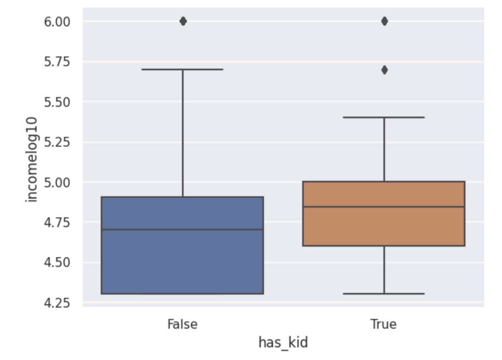
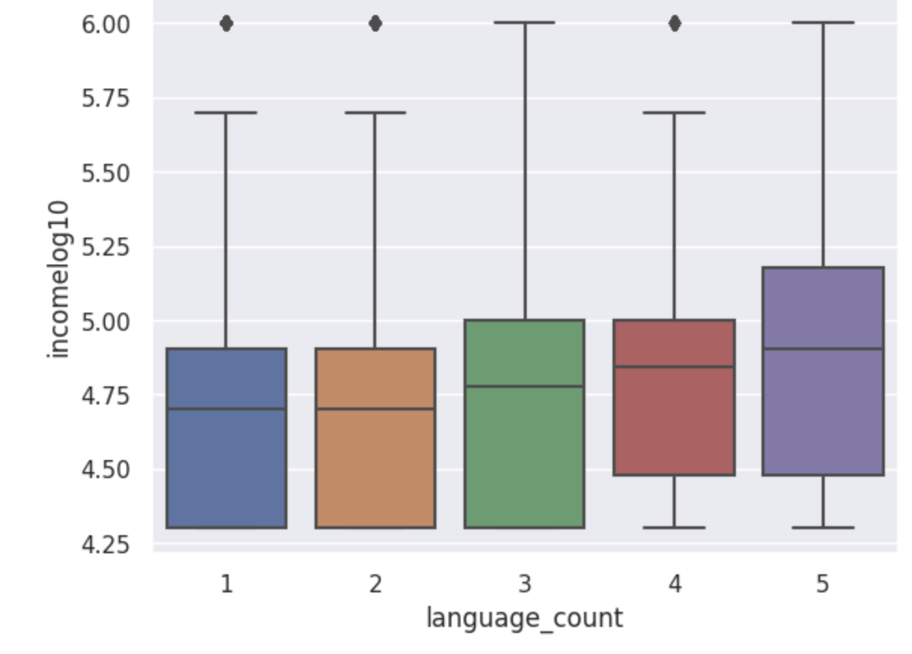
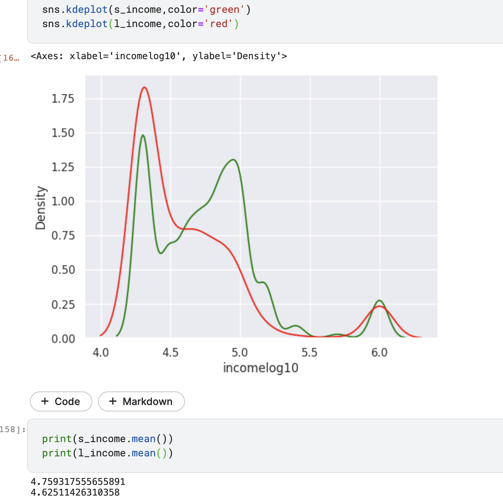
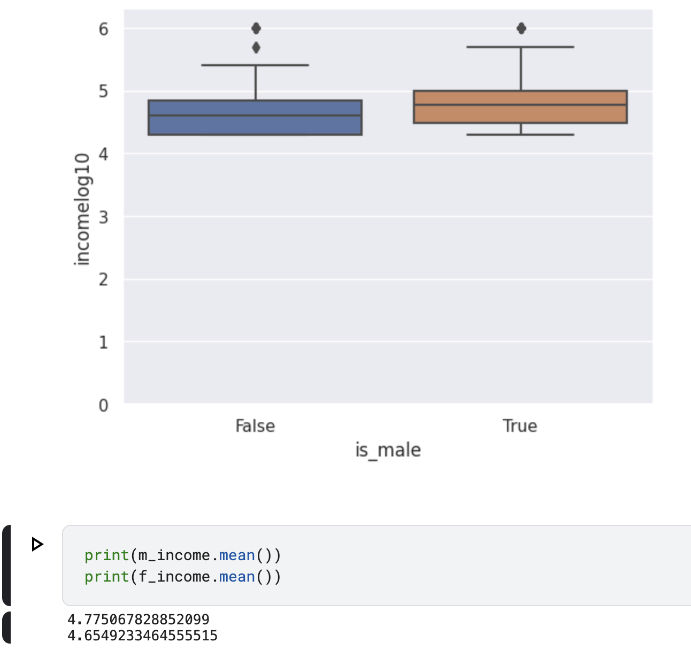
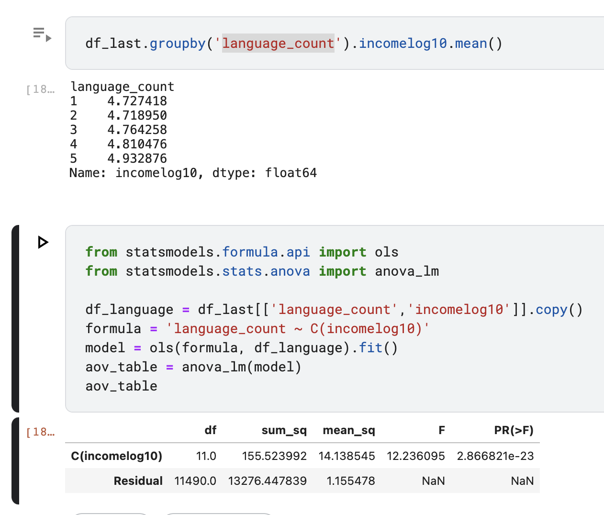

# OkCupid Profiles Description

- Source: https://www.kaggle.com/datasets/andrewmvd/okcupid-profiles
- My Notebook: https://www.kaggle.com/jakenty1/okcupid-users

## About this Dataset

```
OkCupid is a mobile dating app. It sets itself apart from other dating apps by making use of a pre computed compatibility score, calculated by optional questions the users may choose to answer.

In this dataset, there are 60k records containing structured information such as age, sex, orientation as well as text data from open ended descriptions.
```

## Dataset detail
- Filename: okcupid_profiles.csv
- Filesize: 137.31 MB
- Rows: 59946 records
- Columns:

| Attribute     | Type   | Description                        |
|---------------|--------|------------------------------------|
| 'age':        | int    | Age                                |
| 'status'      | String | Marital Status                     |
| 'sex'         | String | Gender male/female                 |
| 'orientation' | String | Sexual Orientation                 |
| 'body_type'   | String | Body Type                          |
| 'diet'        | String | Diet info                          |
| 'drinks'      | String | Alcohol drinking levels            |
| 'drugs'       | String | Drugs consuming levels             |
| 'education'   | String | Education info                     |
| 'ethnicity'   | String | Population group/ sub group        |
| 'height'      | float  | Height   (1m + x cm)               |
| 'income'      | int    | Income                             |
| 'job'         | String | Job position                       |
| 'last_online' | String | Last time online, YYYY-MM-DD-HH-mm |
| 'location'    | String | Location                           |
| 'offspring'   | String | User offspring status              |
| 'pets'        | String | User pets status                   |
| 'religion'    | String | Religion                           |
| 'sign'        | String | Zodiac signs                       |
| 'smokes'      | String | Smoking status                     |
| 'speaks'      | String | Languages that user can speak      |
| 'essay0'      | String | self essay                         |
| 'essay1'      | String | self essay                         |
| 'essay2'      | String | self essay                         |
| 'essay3'      | String | self essay                         |
| 'essay4'      | String | self essay                         |
| 'essay5'      | String | self essay                         |
| 'essay6'      | String | self essay                         |
| 'essay7'      | String | self essay                         |
| 'essay8'      | String | self essay                         |
| 'essay9'      | String | self essay                         |

## Data exploration
- null count:
```
age                0
status             0
sex                0
orientation        0
body_type       5296
diet           24395
drinks          2985
drugs          14080
education       6628
ethnicity       5680
height             3
income             0
job             8198
last_online        0
location           0
offspring      35561
pets           19921
religion       20226
sign           11056
smokes          5512
speaks            50
essay0          5488
essay1          7572
essay2          9638
essay3         11476
essay4         10537
essay5         10850
essay6         13771
essay7         12451
essay8         19225
essay9         12603
```
- The most complete features are age, status, sex, orientation, height, income, speaks and location

|       |          age |       height |         income |
|------:|-------------:|-------------:|---------------:|
| count | 59946.000000 | 59943.000000 |   59946.000000 |
|  mean |    32.340290 |    68.295281 |   20033.222534 |
|   std |     9.452779 |     3.994803 |   97346.192104 |
|   min |    18.000000 |     1.000000 |      -1.000000 |
|   25% |    26.000000 |    66.000000 |      -1.000000 |
|   50% |    30.000000 |    68.000000 |      -1.000000 |
|   75% |    37.000000 |    71.000000 |      -1.000000 |
|   max |   110.000000 |    95.000000 | 1000000.000000 |

- Ok cupid users have average age 32, height 168 cm and income 20k
- Most of them are single, or self-proclaimed as single
```
status
single            55697
seeing someone     2064
available          1865
married             310
unknown              10
```
- Male users is 1.5 times female
```
sex
m    35829
f    24117
```
- Most of them self-described as straight
```
orientation
straight    86.1%
gay          9.3%
bisexual     4.6%
```
- They are mainly speaking english
```
speaks
english                                                                21828
english (fluently)                                                      6628
english (fluently), spanish (poorly)                                    2059
english (fluently), spanish (okay)                                      1917
english (fluently), spanish (fluently)                                  1288
                                                                       ...
english (fluently), urdu (poorly), japanese (poorly), french (okay)        1
english, spanish, hindi, c++                                               1
english (fluently), japanese (okay), thai (okay), chinese (poorly)         1
english (fluently), french (okay), italian (okay), hebrew (okay)           1
english (fluently), french, farsi                                          1
```
- Most of them are living in san francisco, california
```
location
san francisco, california         31064
oakland, california                7214
berkeley, california               4212
san mateo, california              1331
palo alto, california              1064
                                  ...
south wellfleet, massachusetts        1
orange, california                    1
astoria, new york                     1
london, united kingdom                1
rochester, michigan                   1
```
# Data cleaning and feature engineering
- There is 2 strange users age 109 and 110, I removed them
- Convert sex(m/l) to is_male(True/False)
- Convert orientation to 3 columns (orientation_bisexual	orientation_gay	orientation_straight)
- With drink habit, I assigned a number for their frequency:
```
0 not at all
1 rarely
2 socially
3 often
4 very often
5 desperately
```
and assume 2985 people did not input alcohol habit as 2 (socially)
- Remove null height rows, remove strange height (<10)
- Split 'offspring' to two group: has kid and no kid (has_kid column)
- Assign people do not specify their language as english speakers
- Add columns language_count as number of languages that users can speak
```
language_count
1    29117
2    17227
3     8680
4     3249
5     1662
```
- remove negative income, and use log10 of income instead of income

- The filtered databases contains these columns ['age',
 'height',
 'income',
 'is_male',
 'orientation_bisexual',
 'orientation_gay',
 'orientation_straight',
 'has_kid',
 'language_count']



(Age - Income chart)


(Height - Income chart)



(male - Income chart)


(straight - Income chart)


(haskid - Income chart)


(languagecount - Income chart)

# Hypothesis

## Sexual orientation affect income

Ho: There is no different between income of straight and lgbt

Ha: There is difference between the income of straight people and lgbt people



```python
t_value1 =  11.892619009095835 , p_value1 =  2.0022903264258819e-32

```

```

Conclusion: since p_value 2.0022903264258819e-32 is less than alpha 0.05

Reject the null hypothesis that There is no different between income of straight and lgbt.
```

## Gender affect income

Ho: There is no different between income of male and female

Ha: There is difference between the income of male and female



```
Conclusion: since p_value2 2.0022903264258819e-32 is less than alpha 0.05

Reject the null hypothesis that There is no different between income of male and female.
```

## Language speak affect income

Ho: Income of people speak one, two, three or more language as the same

Ha: There is change when people speak more language


(languagecount - Income chart)



```
p value 2.866821e-23 < 0.05 alpha, so we reject Ho that Income of people speak one, two, three or more language as the same
```
